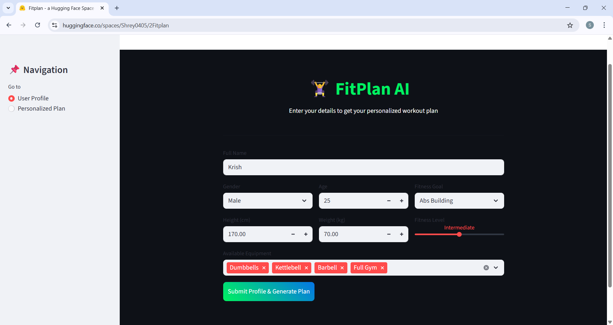
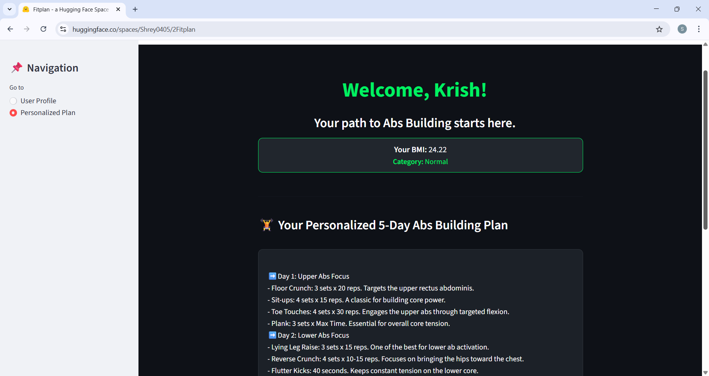
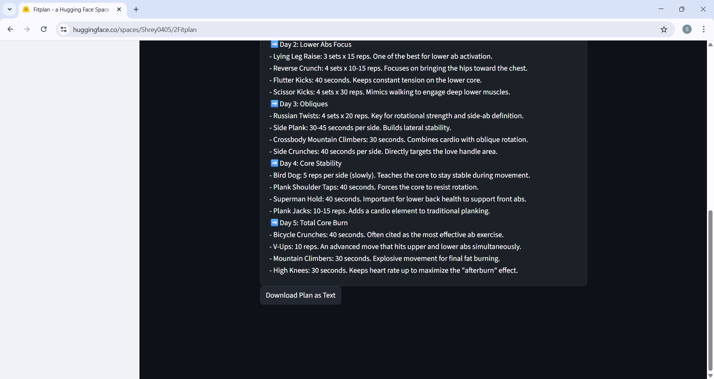

# 🏋️‍♂️ FitPlan AI: Personalized Fitness Plan Generator
### Milestone 2: Core AI Model Integration

**FitPlan AI** is a dynamic fitness assistant that transforms user metrics into actionable, high-performance workout routines. This milestone focuses on the integration of a structured generation model to provide personalized 5-day fitness plans.

---

## 🎯 Milestone Objective
The primary goal of Milestone 2 was to implement the **Core AI Model Integration**. This involved:
* Processing user-specific data (BMI, Age, Fitness Level).
* Constructing dynamic prompts based on available equipment and goals.
* Generating structured 5-day workout sequences.
* Deploying the functional logic to a cloud environment (Hugging Face Spaces).

##  Model Information
* **Model Type:** Logic-Driven Generation Engine.
* **Core Logic:** The application utilizes a `workout_generator` function that acts as a deterministic model, mapping specific user goals (Build Muscle, Weight Loss, Strength Gain, etc.) to optimized training protocols.
* **Inference Method:** Dynamic Template Mapping based on user profile context.

##  Prompt Design Explanation
The system uses a **Context-Aware Prompt Construction** method. The input is not just a goal, but a multi-variable profile:
1. **User Identity:** Name and Age for personalization.
2. **Physical Profile:** Height and Weight are used to calculate **BMI**, which adjusts the plan's context.
3. **Constraint Logic:** "Available Equipment" acts as a filter to ensure the generated exercises are actually possible for the user.
4. **Goal Alignment:** The model selects from five distinct architectural paths (e.g., Hypertrophy for Muscle Build vs. Metabolic Conditioning for Weight Loss).

---

## Implementation Steps

1. **Model Loading:** Integrated a robust generation function into the Streamlit lifecycle.
2. **Prompt Creation:** Developed `prompt_builder.py` logic to synthesize Name, BMI, Goal, Level, and Equipment into a single generation request.
3. **Inference Testing:** Validated the model with different scenarios.
4. **UI Styling:** Implemented a Dark Mode UI with custom CSS for plan readability.

---

## Deployment
The application is live and functional on Hugging Face Spaces:
**[https://huggingface.co/spaces/Shrey0405/2Fitplan]**

---

## 📊 Sample Generated Output

**User Profile:** * **Name:** Krish  
* **Fitness Goal:** Abs Building  
* **BMI Category:** Normal  

> ### 🏋️ Your Personalized 5-Day Abs Building Plan
> 
> ➡️ **Day 1: Upper Abs Focus**
> - **Floor Crunch:** 3 sets x 20 reps. Targets the upper rectus abdominis.
> - **Sit-ups:** 4 sets x 15 reps. A classic for building core power.
> - **Toe Touches:** 4 sets x 30 reps. Engages the upper abs through targeted flexion.
> - **Plank:** 3 sets x Max Time. Essential for overall core tension.
> 
> ➡️ **Day 2: Lower Abs Focus**
> - **Lying Leg Raise:** 3 sets x 15 reps. One of the best for lower ab activation.
> - **Reverse Crunch:** 4 sets x 10-15 reps. Focuses on bringing the hips toward the chest.
> - **Flutter Kicks:** 40 seconds. Keeps constant tension on the lower core.
> - **Scissor Kicks:** 4 sets x 30 reps. Mimics walking to engage deep lower muscles.
> 
> ➡️ **Day 3: Obliques**
> - **Russian Twists:** 4 sets x 20 reps. Key for rotational strength and side-ab definition.
> - **Side Plank:** 30-45 seconds per side. Builds lateral stability.
> - **Crossbody Mountain Climbers:** 30 seconds. Combines cardio with oblique rotation.
> - **Side Crunches:** 40 seconds per side. Directly targets the lateral core.
> 
> ➡️ **Day 4: Core Stability**
> - **Bird Dog:** 5 reps per side (slowly). Teaches the core to stay stable during movement.
> - **Plank Shoulder Taps:** 40 seconds. Forces the core to resist rotation.
> - **Superman Hold:** 40 seconds. Supports lower back health to balance front abs.
> - **Plank Jacks:** 10-15 reps. Adds a cardio element to traditional planking.
> 
> ➡️ **Day 5: Total Core Burn**
> - **Bicycle Crunches:** 40 seconds. Most effective move for total ab activation.
> - **V-Ups:** 10 reps. Hits upper and lower abs simultaneously.
> - **Mountain Climbers:** 30 seconds. Explosive movement for final calorie burn.
> - **High Knees:** 30 seconds. Maximizes the "afterburn" effect to reveal definition.

---

###  Application Gallery

#### **1. User Input Interface**
*apturing user metrics including BMI calculation and fitness goal selection.*

#### **2. Generation Process**
*Dynamic Generation:** The core AI logic processing the "Abs Building" prompt to create a specific routine.*

#### **3. Final Workout Plan**
*The final 5-day plan displayed with high readability and a download option.*

---

